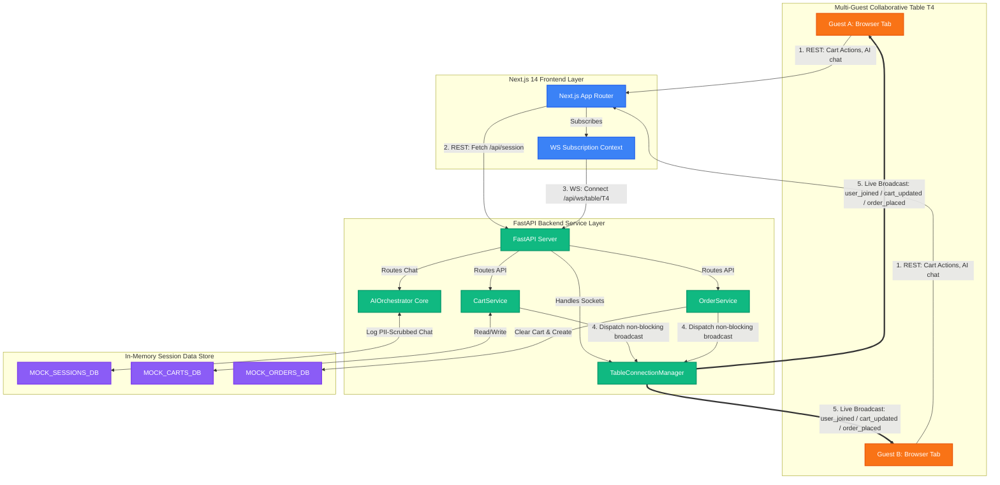

# Gourmet AI — Collaborative Tableside Smart Dining Assistant 🍽️🤖

Welcome to **Gourmet AI**, a modern, full-stack, mobile-first monorepo designed for collaborative restaurant dining and automated tableside ordering. It combines an interactive **Next.js 14 Web Application** frontend with a robust, strictly typed **FastAPI web service** backend, integrated with frothed multi-user syncing and AI-powered recommendations.

---

## 🚀 Live Demo Placeholders

| Service | Hosting Provider | Deployment Endpoint |
| :--- | :--- | :--- |
| **Frontend Web App** | Vercel | `https://smart-dining-frontend.vercel.app` (Placeholder) |
| **Backend Web Service** | Render | `https://smart-dining-backend.onrender.com` (Placeholder) |

---

## ⚡ Local Setup in 4 Steps

Ensure you have **Node.js (v18+)** and **Python (v3.11+)** installed locally.

### Step 1: Clone & Configure Environments
Copy the backend `.env.example` to `.env` inside `backend/`, and the frontend `.env.example` to `.env.local` inside `frontend/`. 
The default configuration works out-of-the-box for local testing.

### Step 2: Set Up Python Virtual Environment & Dependencies
```bash
cd backend
python -m venv .venv
# Activate: Windows (.venv\Scripts\Activate.ps1) | macOS/Linux (source .venv/bin/activate)
pip install -r requirements.txt
```

### Step 3: Run the FastAPI Backend Server
```bash
uvicorn app.main:app --reload --port 8000
```
*API docs will be available instantly at [http://localhost:8000/docs](http://localhost:8000/docs).*

### Step 4: Run the Next.js Frontend
```bash
cd ../frontend
npm install
npm run dev
```
*Launch your browser at [http://localhost:3000/table/T4](http://localhost:3000/table/T4) to start ordering at Table T4!*

---

## 🗺️ System Architecture



---

## 🤖 Agent Design & Tool Access

Gourmet AI features **Zara**, a frothed tableside AI assistant. Rather than relying on simple static chat prompts, Zara is structured around a multi-stage **agent orchestration framework** designed to parse user inputs, scrub PII, recognize restaurant intent, and upsell products dynamically:

1. **Multilingual Normalizer**: Sanitizes and normalizes typing shortcuts, spelling mistakes, Hinglish, Telugu-English, and standard English to identify user dining preferences (`veg`, `non-veg`, `spicy`, `sweet`).
2. **Intent Router**: Analyzes query keywords to categorize requests into standard dining tasks:
   - `waiter_call`: Pages waiter/service staff to assist Table ID.
   - `order_status`: Inquires about current kitchen preparation wait times.
   - `conclude_session`: Triggered when guests say "that's all" or "bas".
   - `recommendation`: Triggers dish suggestions.
3. **Context-Aware Upsell Agent**: Evaluates the table's active cart context and triggers highly frothed, friendly upsell suggestions:
   - *evening-time special*: Suggests warm *Kesari Masala Chai* or chilled *Payasam* desserts if local time is in the evening.
   - *mains without drinks*: Offers premium *Royal Mango Lassis* or *Smoked Rosemary Berry Coolers* if curries are ordered without beverages.
   - *subtotal milestone*: Promotes chef specials if the cart exceeds ₹500.
   - *complementary item pairing*: Links mains to breads/rice (e.g. *Butter Garlic Naan* with *Butter Chicken*).
   - *Strict Guardrails*: **Never** suggests items already present in the user's cart.
4. **Recommendation Agent**: Filters available menu candidates, scores them against user preferences and item popularity scores, and returns up to 3 dishes with conversational reasons matching the user's dialect.
5. **PII and XSS Safeguards**: 
   - **`sanitize_input`**: Strips out HTML tags and scripting tags (anti-XSS parsing) before text processing.
   - **`strip_pii`**: Uses high-performance regex scrubbers to automatically redact telephone numbers and email addresses (`[PHONE_REDACTED]`, `[EMAIL_REDACTED]`) before query contexts are logged to memory.

---

## 🛰️ REST and WebSocket API Overview

The monorepo exposes the following modular REST endpoints and WebSocket paths:

| Domain | Protocol | Route | Method | Purpose |
| :--- | :--- | :--- | :--- | :--- |
| **Session** | REST | `/api/table/{tableId}/session` | `GET` | Fetch or create an active dining session with a 2-hour TTL. |
| **Menu** | REST | `/api/menu` | `GET` | Fetch all menu items or filter by category. |
| **Menu** | REST | `/api/menu/search?q=query` | `GET` | Search dishes by name, description, or tag keywords. |
| **Cart** | REST | `/api/session/{sessionId}/cart` | `GET` | Retrieve shared cart details, subtotal, and 5% GST breakdown. |
| **Cart** | REST | `/api/session/{sessionId}/cart` | `POST` | Add a menu item to the cart (Last-Write-Wins special instructions). |
| **Cart** | REST | `/api/session/{sessionId}/cart/{itemId}` | `PATCH` | Edit item quantities or overwrite instructions. |
| **Cart** | REST | `/api/session/{sessionId}/cart/{itemId}` | `DELETE` | Remove an item completely from the collaborative table cart. |
| **AI Chat** | REST | `/api/session/{sessionId}/ai/chat` | `POST` | Send queries to AI dining guide Zara (PII-Scrubbed). |
| **Order** | REST | `/api/session/{sessionId}/order` | `POST` | Check out cart items. Clears cart and issues kitchen ticket. |
| **Live Sync** | WebSocket | `/api/ws/table/{table_id}` | `WS` | Subscribes to table broadcasts (`user_joined`, `cart_updated`, `order_placed`). |

---

## 💡 Design Decisions

- **REST + Async WebSockets**: Kept all database CRUD transactions inside standard REST endpoints to ensure robust request/response cycles. Any cart mutations dispatch non-blocking WebSocket broadcasts (`asyncio.create_task`) to synchronize other guests sitting at the same table instantly.
- **Strict TypeScript Boundaries (`tsconfig.json` & `types/index.ts`)**: Structured standard Typescript types mapped precisely to Python Pydantic schemas, eliminating common API mismatch errors.
- **Glassmorphic Handheld UI**: Built a premium mobile-first interface optimized for single-hand smartphone scrolling with Harmony HSL styling, category chips, allergen filters, and sliding cart/chat drawers.
- **Live User Counters & Glow Indicators**: Displays colored guest initials for active users at the table, flashing an **emerald green glow animation** (`ring-2 ring-emerald-500 bg-emerald-950/20`) for 1.5 seconds on other clients' screens whenever the shared cart is modified by table partners.

---

## ⚖️ Architectural Trade-offs

- **In-Memory Store vs. Database System**:
  - *Trade-off*: We used volatile, thread-safe memory stores (`MOCK_CARTS_DB`, `SESSION_AI_MEMORY`) instead of persistent databases like PostgreSQL or Redis.
  - *Rationale*: Extracted all installation friction. The project launches instantly without requiring Docker containers or DB credential configuration, making it extremely demo-friendly for assignment evaluators.
- **Mock SMS Delivery**:
  - *Trade-off*: Used a fixed mock verification OTP code (`123456`) and mock token generation.
  - *Rationale*: Avoids real-world Twilio subscription costs and API billing limits while demonstrating the full end-to-end security flow.

---

## 🤖 Unified Free LLM Integration (Zero-Config Out-of-the-Box!)

Gourmet AI features a state-of-the-art **multi-provider LLM core engine** supporting structured JSON output and real-time menu/cart context. 

### Supported Providers (Automatic Cascading Failover)
1. **DuckDuckGo Chat API (Default, Key-Less & Free)**: Zero-configuration required! Works completely out of the box globally without requiring any API keys, accounts, registration, or local server installations. Accesses unauthenticated `gpt-4o-mini` under the hood!
2. **Google Gemini Free Tier (Recommended)**: Utilizes `gemini-1.5-flash` with a completely free daily request limit. Simply add `GEMINI_API_KEY` (generated instantly in [Google AI Studio](https://aistudio.google.com/)) to your `backend/.env` file with no credit cards required.
3. **Local Ollama**: If you have [Ollama](https://ollama.com/) running locally with models like `llama3` or `gemma`, we automatically detect and route query traffic to your local server (`http://localhost:11434`), keyless and offline.
4. **OpenAI API**: If an `OPENAI_API_KEY` is present.
5. **Rules Fallback**: If no cloud connections or keys are detected, the server cascades safely to a high-fidelity local multilingual regex parsing engine.

---

## 🔮 Roadmap: Future Enhancements

Given more time, the following features would be implemented to transition the project from a high-fidelity prototype to a production deployment:
1. **Persistent SQL/NoSQL Database**: Mount PostgreSQL/Prisma for order history tracking and Redis for sub-millisecond WebSocket session pub/sub distribution.
2. **Real Twilio SMS Dispatch**: Connect authentic phone inputs to Twilio's SMS API for live OTP security verification.
3. **LLM Function Calling (Cart Operations)**: Add function calling/tool usage to allow Zara to directly modify cart items ("Zara, make my Paneer Tikka extra spicy and add it to my cart!").

---

## 💬 Dialogue Examples: Zara AI Assistant

### Example 1: Hinglish Dialect recommendation query
- **User Prompt**: *"Bhai, spicy biryani or lassi suggest karo na! Mera number +91 99999-00000 hai."*
- **Scrubbed AI Memory**: *"Bhai, spicy biryani or lassi suggest karo na! Mera number [PHONE_REDACTED] hai."*
- **Zara Output**: 
  > "Aapke taste ke hisab se maine kuch top tandoori and biryani items select kiye hain! Hamari Gourmet Chicken Dum Biryani (m14) kaafi teekhi aur flavorful hai, aur iske saath hamari premium Mango Lassi (m21) bilkul perfect rahega!"
  > *[Suggests cards for Gourmet Chicken Dum Biryani and Royal Mango Lassi directly inside the chat log]*

### Example 2: Telugu-English beverage pairing upsell
- **User Prompt**: *"Mains order chesanu andi, emaina cold drinks suggested?"*
- **Zara Output**:
  > "Mee cart lo tasty mains unnay kani drinks levu andi. Ma Royal Mango Lassi thagithe chala fresh ga untundi, and we also suggest trying our tableside Smoked Rosemary Berry Cooler (m23) to pair with your curries!"
  > *[Suggests cards for Royal Mango Lassi and Smoked Rosemary Berry Cooler]*

### Example 3: English session conclusion trigger (with dessert upsell)
- **User Prompt**: *"That's all for today, thank you!"*
- **Zara Output**:
  > "Wonderful! How about concluding your meal on a sweet note with our special Gulab Jamun with Rabri Trio (m17)? It is slow-cooked over saffron kesar rabri and is highly popular!"
  > *[Suggests card for Gulab Jamun with Rabri Trio]*
